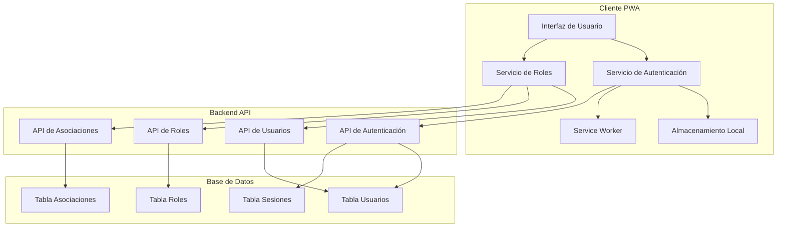
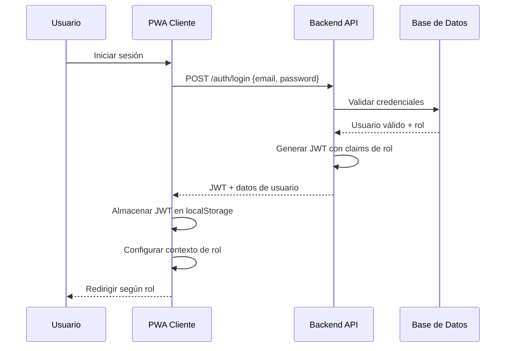
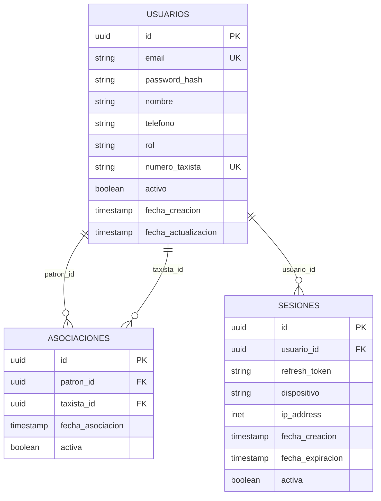

# Documento de Diseño: Sistema de Autenticación con Roles

## Resumen

El sistema de autenticación con roles para la aplicación PWA de taxi implementa un modelo de control de acceso basado en roles (RBAC) que permite la gestión diferenciada entre Patrones y Taxistas. El diseño utiliza JWT para autenticación stateless, almacenamiento local para capacidades offline, y un modelo de datos que soporta asociaciones jerárquicas entre usuarios.

## Arquitectura

### Arquitectura General



### Flujo de Autenticación



## Componentes e Interfaces

### Servicio de Autenticación (AuthService)

**Responsabilidades:**
- Gestión de login/logout
- Validación y renovación de tokens JWT
- Manejo de sesiones offline
- Integración con funcionalidades existentes

**Interfaz Principal:**
```typescript
interface AuthService {
  login(credentials: LoginCredentials): Promise<AuthResult>
  logout(): Promise<void>
  getCurrentUser(): User | null
  isAuthenticated(): boolean
  refreshToken(): Promise<string>
  validateOfflineAccess(): boolean
}

interface LoginCredentials {
  email: string
  password: string
}

interface AuthResult {
  user: User
  token: string
  refreshToken: string
  expiresAt: Date
}
```

### Servicio de Roles (RoleService)

**Responsabilidades:**
- Gestión de permisos según rol
- Validación de acceso a funcionalidades
- Manejo de asociaciones Patrón-Taxista
- Filtrado de datos según contexto de rol

**Interfaz Principal:**
```typescript
interface RoleService {
  getUserRole(): UserRole
  hasPermission(permission: Permission): boolean
  getAssociatedUsers(): Promise<User[]>
  createAssociation(patronId: string, taxistaId: string): Promise<Association>
  removeAssociation(associationId: string): Promise<void>
  filterDataByRole<T>(data: T[]): T[]
}

enum UserRole {
  PATRON = 'patron',
  TAXISTA = 'taxista'
}

enum Permission {
  VIEW_ALL_DRIVERS = 'view_all_drivers',
  MANAGE_ASSOCIATIONS = 'manage_associations',
  VIEW_OWN_DATA = 'view_own_data',
  EDIT_PROFILE = 'edit_profile'
}
```

### API de Autenticación

**Endpoints principales:**
```
POST /api/auth/register
POST /api/auth/login
POST /api/auth/refresh
POST /api/auth/logout
GET /api/auth/profile
```

**Estructura de respuesta JWT:**
```json
{
  "sub": "user_id",
  "email": "user@example.com",
  "role": "patron|taxista",
  "numero_taxista": "TX001", // solo para taxistas
  "permissions": ["view_own_data", "manage_associations"],
  "iat": 1640995200,
  "exp": 1641081600
}
```

### API de Gestión de Roles

**Endpoints principales:**
```
GET /api/roles/associations
POST /api/roles/associations
DELETE /api/roles/associations/{id}
GET /api/roles/users/search
GET /api/roles/permissions
```

## Modelos de Datos

### Modelo de Usuario
```sql
CREATE TABLE usuarios (
    id UUID PRIMARY KEY DEFAULT gen_random_uuid(),
    email VARCHAR(255) UNIQUE NOT NULL,
    password_hash VARCHAR(255) NOT NULL,
    nombre VARCHAR(255) NOT NULL,
    telefono VARCHAR(20),
    rol VARCHAR(20) NOT NULL CHECK (rol IN ('patron', 'taxista')),
    numero_taxista VARCHAR(10) UNIQUE, -- solo para taxistas
    activo BOOLEAN DEFAULT true,
    fecha_creacion TIMESTAMP DEFAULT CURRENT_TIMESTAMP,
    fecha_actualizacion TIMESTAMP DEFAULT CURRENT_TIMESTAMP
);
```

### Modelo de Asociaciones
```sql
CREATE TABLE asociaciones (
    id UUID PRIMARY KEY DEFAULT gen_random_uuid(),
    patron_id UUID NOT NULL REFERENCES usuarios(id),
    taxista_id UUID NOT NULL REFERENCES usuarios(id),
    fecha_asociacion TIMESTAMP DEFAULT CURRENT_TIMESTAMP,
    activa BOOLEAN DEFAULT true,
    UNIQUE(patron_id, taxista_id),
    CHECK (patron_id != taxista_id)
);
```

### Modelo de Sesiones (para gestión de tokens)
```sql
CREATE TABLE sesiones (
    id UUID PRIMARY KEY DEFAULT gen_random_uuid(),
    usuario_id UUID NOT NULL REFERENCES usuarios(id),
    refresh_token VARCHAR(500) NOT NULL,
    dispositivo VARCHAR(255),
    ip_address INET,
    fecha_creacion TIMESTAMP DEFAULT CURRENT_TIMESTAMP,
    fecha_expiracion TIMESTAMP NOT NULL,
    activa BOOLEAN DEFAULT true
);
```

### Relaciones entre Entidades


## Propiedades de Corrección

*Una propiedad es una característica o comportamiento que debe mantenerse verdadero en todas las ejecuciones válidas de un sistema—esencialmente, una declaración formal sobre lo que el sistema debe hacer. Las propiedades sirven como puente entre las especificaciones legibles por humanos y las garantías de corrección verificables por máquina.*

Ahora voy a realizar el análisis previo de los criterios de aceptación para determinar qué propiedades son testables.

### Propiedades de Corrección Consolidadas

**Propiedad 1: Asignación correcta de permisos según rol**
*Para cualquier* usuario que se registre con un rol específico, el sistema debe asignar exactamente los permisos correspondientes a ese rol y, en el caso de taxistas, un número único.
**Valida: Requisitos 1.2, 1.3**

**Propiedad 2: Validación de campos obligatorios**
*Para cualquier* intento de registro, si faltan campos obligatorios, el sistema debe rechazar la operación y mantener el estado anterior.
**Valida: Requisitos 1.4**

**Propiedad 3: Búsqueda filtrada por rol**
*Para cualquier* búsqueda de usuarios realizada por un patrón, el sistema debe devolver únicamente usuarios con rol "Taxista" que no estén ya asociados.
**Valida: Requisitos 2.1**

**Propiedad 4: Creación de asociaciones válidas**
*Para cualquier* patrón y taxista disponible, cuando se crea una asociación válida, el sistema debe establecer la relación y generar la notificación correspondiente.
**Valida: Requisitos 2.2, 2.3**

**Propiedad 5: Integridad durante cambios de asociación**
*Para cualquier* operación de creación o eliminación de asociaciones, el sistema debe mantener la integridad de las cuentas individuales y los accesos independientes.
**Valida: Requisitos 2.5, 4.3, 4.4**

**Propiedad 6: Filtrado contextual de datos**
*Para cualquier* consulta de datos realizada por un usuario autenticado, el sistema debe filtrar y mostrar únicamente la información a la que tiene permisos según su rol y asociaciones.
**Valida: Requisitos 3.1, 3.2, 3.3, 5.1, 5.4, 5.5**

**Propiedad 7: Control de acceso y validación de permisos**
*Para cualquier* intento de acceso a funcionalidades o datos, el sistema debe validar permisos antes de permitir el acceso y denegar operaciones no autorizadas.
**Valida: Requisitos 3.4, 6.1, 6.2**

**Propiedad 8: Asociación automática de datos con usuario**
*Para cualquier* dato operativo introducido por un usuario autenticado, el sistema debe asociar automáticamente la información con el usuario correcto según su rol y número identificador.
**Valida: Requisitos 4.1, 4.2, 5.3**

**Propiedad 9: Acceso a historial personal**
*Para cualquier* taxista autenticado, el sistema debe proporcionar acceso completo a su historial de datos y servicios registrados.
**Valida: Requisitos 4.5**

**Propiedad 10: Aplicación consistente de permisos en operaciones**
*Para cualquier* operación de reconciliación, gestión de servicios o gastos, el sistema debe aplicar permisos de manera consistente según el rol del usuario.
**Valida: Requisitos 5.2**

**Propiedad 11: Manejo de expiración de sesiones**
*Para cualquier* sesión expirada, el sistema debe requerir nueva autenticación antes de permitir cualquier operación posterior.
**Valida: Requisitos 6.3**

**Propiedad 12: Seguridad en modificaciones sensibles**
*Para cualquier* modificación de datos sensibles, el sistema debe requerir confirmación adicional antes de procesar el cambio.
**Valida: Requisitos 6.4**

**Propiedad 13: Encriptación de datos sensibles**
*Para cualquier* credencial o dato sensible almacenado, el sistema debe mantenerlo encriptado en todo momento.
**Valida: Requisitos 6.5**

## Manejo de Errores

### Estrategias de Manejo de Errores

**Errores de Autenticación:**
- Credenciales inválidas: Mensaje genérico para evitar enumeración de usuarios
- Sesión expirada: Redirección automática a login con mensaje informativo
- Token inválido: Limpieza de almacenamiento local y reautenticación

**Errores de Autorización:**
- Acceso denegado: Mensaje claro sobre permisos insuficientes
- Rol inválido: Validación en cliente y servidor con fallback seguro
- Asociación inválida: Validación de reglas de negocio con mensajes específicos

**Errores de Conectividad:**
- Modo offline: Funcionalidad limitada con datos en caché
- Timeout de red: Reintentos automáticos con backoff exponencial
- Sincronización: Cola de operaciones pendientes para cuando se restaure conectividad

**Errores de Validación:**
- Campos obligatorios: Validación en tiempo real con mensajes contextuales
- Formato inválido: Validación de patrones con sugerencias de corrección
- Duplicados: Detección temprana con opciones de resolución

### Códigos de Error Estándar

```typescript
enum AuthErrorCodes {
  INVALID_CREDENTIALS = 'AUTH_001',
  SESSION_EXPIRED = 'AUTH_002',
  INSUFFICIENT_PERMISSIONS = 'AUTH_003',
  INVALID_TOKEN = 'AUTH_004',
  USER_NOT_FOUND = 'AUTH_005',
  DUPLICATE_EMAIL = 'AUTH_006',
  INVALID_ASSOCIATION = 'AUTH_007',
  ROLE_MISMATCH = 'AUTH_008'
}
```

## Estrategia de Testing

### Enfoque Dual de Testing

El sistema implementará tanto **pruebas unitarias** como **pruebas basadas en propiedades** para garantizar cobertura comprehensiva:

**Pruebas Unitarias:**
- Casos específicos y ejemplos concretos
- Casos límite y condiciones de error
- Puntos de integración entre componentes
- Validación de flujos de UI específicos

**Pruebas Basadas en Propiedades:**
- Validación de propiedades universales a través de múltiples entradas
- Cobertura exhaustiva mediante randomización
- Verificación de invariantes del sistema
- Validación de reglas de negocio complejas

### Configuración de Pruebas Basadas en Propiedades

**Biblioteca recomendada:** fast-check (para TypeScript/JavaScript)
**Configuración mínima:** 100 iteraciones por prueba de propiedad
**Formato de etiquetas:** `Feature: autenticacion-roles, Property {número}: {texto de la propiedad}`

### Ejemplos de Implementación de Testing

**Prueba de Propiedad - Asignación de Permisos:**
```typescript
// Feature: autenticacion-roles, Property 1: Asignación correcta de permisos según rol
it('should assign correct permissions based on user role', () => {
  fc.assert(fc.property(
    fc.record({
      email: fc.emailAddress(),
      password: fc.string({ minLength: 8 }),
      nombre: fc.string({ minLength: 2 }),
      rol: fc.constantFrom('patron', 'taxista')
    }),
    (userData) => {
      const user = authService.register(userData);
      
      if (userData.rol === 'patron') {
        expect(user.permissions).toContain('manage_associations');
        expect(user.permissions).toContain('view_all_drivers');
      } else {
        expect(user.permissions).toContain('view_own_data');
        expect(user.numeroTaxista).toBeDefined();
        expect(user.numeroTaxista).toMatch(/^TX\d{3}$/);
      }
    }
  ));
});
```

**Prueba Unitaria - Caso de Error Específico:**
```typescript
it('should reject registration with duplicate email', async () => {
  const userData = {
    email: 'test@example.com',
    password: 'password123',
    nombre: 'Test User',
    rol: 'taxista'
  };
  
  await authService.register(userData);
  
  await expect(authService.register(userData))
    .rejects
    .toThrow('Email already registered');
});
```

### Cobertura de Testing

**Áreas críticas que requieren testing exhaustivo:**
- Validación de permisos y control de acceso
- Integridad de asociaciones Patrón-Taxista
- Filtrado de datos según contexto de rol
- Manejo de sesiones y tokens JWT
- Sincronización offline/online
- Validación de entrada y sanitización de datos

**Métricas de cobertura objetivo:**
- Cobertura de código: >90%
- Cobertura de propiedades: 100% de propiedades críticas
- Cobertura de casos límite: >95%
- Pruebas de integración: Todos los flujos principales