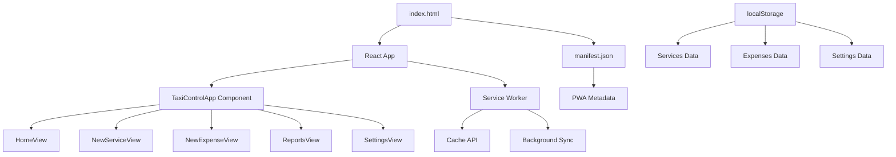

# Design Document

## Overview

Este diseño completa una PWA de control de taxi existente que tiene errores de sintaxis y componentes faltantes. La aplicación permite a los taxistas registrar servicios, gastos y generar reportes con funcionalidad offline completa.

La aplicación actual está implementada en React con Tailwind CSS y usa localStorage para persistencia. Necesitamos arreglar errores de sintaxis, completar componentes faltantes, y añadir la infraestructura PWA (manifest, service worker, HTML base).

## Architecture



### Component Hierarchy
- **TaxiControlApp**: Componente principal con estado global
- **Views**: HomeView, NewServiceView, NewExpenseView, ReportsView, SettingsView
- **UI Components**: StatCard, NavButton, ServiceCard
- **Infrastructure**: Service Worker, Manifest, HTML shell

## Components and Interfaces

### Missing Components to Implement

#### StatCard Component
```typescript
interface StatCardProps {
  theme: ThemeConfig;
  label: string;
  value: string | number;
  icon?: React.ReactNode;
  color?: 'green' | 'red' | 'blue' | 'default';
}
```

#### NavButton Component
```typescript
interface NavButtonProps {
  icon: React.ReactNode;
  label: string;
  active: boolean;
  onClick: () => void;
  theme: ThemeConfig;
}
```

#### ThemeConfig Interface
```typescript
interface ThemeConfig {
  bg: string;
  card: string;
  text: string;
  textSecondary: string;
  border: string;
  input: string;
}
```

### File Structure
```
/
├── index.html              # HTML shell
├── index.js               # React app (fixed)
├── manifest.json          # PWA manifest
├── sw.js                  # Service worker
├── icons/                 # PWA icons
│   ├── icon-192.png
│   └── icon-512.png
└── styles.css            # Additional CSS if needed
```

## Data Models

### Service Record
```typescript
interface ServiceRecord {
  id: number;
  platform: string;
  price: string;
  tip?: string;
  extras?: string;
  startTime: string;
  endTime: string;
  origin?: string;
  destination?: string;
}
```

### Expense Record
```typescript
interface ExpenseRecord {
  id: number;
  category: string;
  amount: string;
  notes?: string;
  photo?: string;
  timestamp: string;
}
```

### App State
```typescript
interface AppState {
  darkMode: boolean;
  view: 'home' | 'newService' | 'newExpense' | 'reports' | 'settings';
  services: ServiceRecord[];
  expenses: ExpenseRecord[];
  expenseCategories: string[];
  editingService: ServiceRecord | null;
}
```

## Correctness Properties

*A property is a characteristic or behavior that should hold true across all valid executions of a system-essentially, a formal statement about what the system should do. Properties serve as the bridge between human-readable specifications and machine-verifiable correctness guarantees.*

### Converting EARS to Properties

Basándome en el análisis de prework, la mayoría de los criterios de aceptación son ejemplos específicos o casos de prueba únicos, pero algunos pueden convertirse en propiedades universales:

**Property 1: Component prop validation**
*For any* React component in the Taxi_App, when it's rendered with props, all required props should be provided with correct types
**Validates: Requirements 2.4**

**Property 2: Responsive layout consistency**
*For any* viewport size within mobile and desktop ranges, the Taxi_App should maintain proper layout and usability
**Validates: Requirements 5.2**

**Property 3: Theme application consistency**
*For any* theme state (dark or light), all UI components should apply the corresponding theme classes consistently
**Validates: Requirements 5.4**

**Property 4: Service data persistence**
*For any* valid service record, when added to the app, it should be stored in localStorage and retrievable after page reload
**Validates: Requirements 6.1**

**Property 5: Expense data integrity**
*For any* expense record with valid category and amount, when stored, it should maintain all provided data fields accurately
**Validates: Requirements 6.2**

**Property 6: Report calculation accuracy**
*For any* set of services and expenses, the calculated totals (income, expenses, profit) should equal the mathematical sum of individual records
**Validates: Requirements 6.3**

**Property 7: Session persistence**
*For any* application state (services, expenses, settings), when the app is reloaded, all previously stored data should be restored exactly
**Validates: Requirements 6.4**

## Error Handling

### Syntax Error Recovery
- **Missing Components**: Provide default implementations for all missing components
- **Unclosed Tags**: Systematically close all JSX elements
- **Import Errors**: Ensure all imports have corresponding exports

### Runtime Error Handling
- **localStorage Failures**: Graceful degradation when localStorage is unavailable
- **Service Worker Errors**: App should function without service worker if registration fails
- **Network Errors**: Offline-first approach with proper error messaging

### Data Validation
- **Service Records**: Validate required fields (platform, price) before saving
- **Expense Records**: Validate amount is numeric and category exists
- **Export Data**: Handle empty datasets gracefully in CSV export

## Testing Strategy

### Unit Testing Approach
- **Component Tests**: Test each missing component (StatCard, NavButton) renders correctly
- **Syntax Validation**: Verify JavaScript/JSX parses without errors
- **PWA Structure**: Test manifest.json validity and HTML structure
- **Service Worker**: Test registration and basic caching functionality

### Property-Based Testing Configuration
- **Testing Library**: Jest with React Testing Library for component testing
- **Property Tests**: Use fast-check for property-based testing where applicable
- **Minimum Iterations**: 100 iterations per property test
- **Test Tags**: Each property test tagged with format: **Feature: taxi-pwa-completion, Property {number}: {property_text}**

### Integration Testing
- **End-to-End Flows**: Test complete user journeys (add service, view reports, export data)
- **PWA Installation**: Test app installability and offline functionality
- **Cross-Browser**: Verify functionality across major browsers
- **Responsive Testing**: Test layouts at various screen sizes

### Testing Balance
- **Unit Tests**: Focus on component rendering, data validation, and error conditions
- **Property Tests**: Verify universal behaviors like data persistence and calculation accuracy
- **Integration Tests**: Validate complete user workflows and PWA functionality
- Both unit and property tests are necessary for comprehensive coverage

The testing strategy emphasizes fixing syntax errors first, then validating component completeness, and finally ensuring PWA functionality works correctly across all scenarios.