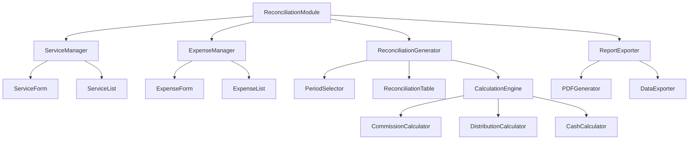
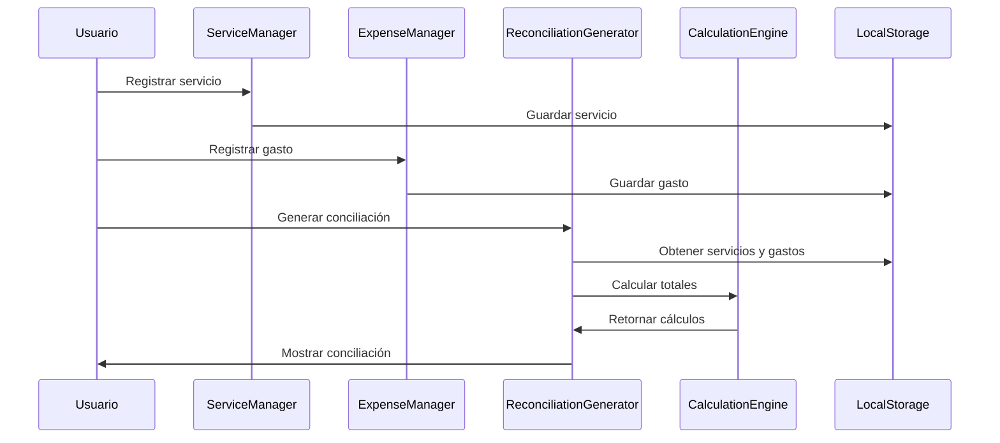

# Documento de Diseño - Conciliación de Taxista

## Visión General

El módulo de conciliación de taxista es una extensión de la PWA existente que permite generar reportes detallados de ingresos, gastos y distribuciones. El sistema se integra con la estructura existente de React y utiliza localStorage para persistencia, manteniendo la arquitectura modular y responsiva.

## Arquitectura

### Arquitectura de Componentes



### Flujo de Datos



## Componentes e Interfaces

### Componente Principal: ReconciliationModule

```typescript
interface ReconciliationModuleProps {
  existingServices?: Service[];
  existingExpenses?: Expense[];
}

interface ReconciliationModuleState {
  activeTab: 'services' | 'expenses' | 'reconciliation';
  selectedPeriod: DateRange;
  currentReconciliation?: ReconciliationData;
}
```

### ServiceManager

Gestiona el registro y visualización de servicios de taxi.

```typescript
interface Service {
  id: string;
  date: Date;
  startTime: string;
  totalAmount: number;
  paymentType: 'cash' | 'card' | 'app';
  platform?: 'freenow' | 'other';
  isArticulated: boolean;
  commission?: number;
  incentives?: number;
  tips?: number;
}

interface ServiceManagerProps {
  services: Service[];
  onAddService: (service: Service) => void;
  onUpdateService: (id: string, service: Partial<Service>) => void;
  onDeleteService: (id: string) => void;
}
```

### ExpenseManager

Maneja el registro de gastos del vehículo.

```typescript
interface Expense {
  id: string;
  date: Date;
  concept: string;
  amount: number;
  category: 'fuel' | 'maintenance' | 'insurance' | 'other';
}

interface ExpenseManagerProps {
  expenses: Expense[];
  onAddExpense: (expense: Expense) => void;
  onUpdateExpense: (id: string, expense: Partial<Expense>) => void;
  onDeleteExpense: (id: string) => void;
}
```

### ReconciliationGenerator

Genera las conciliaciones basadas en servicios y gastos del período.

```typescript
interface ReconciliationData {
  id: string;
  period: DateRange;
  services: Service[];
  expenses: Expense[];
  dailyTotals: DailyTotal[];
  summary: ReconciliationSummary;
  cashBreakdown: CashBreakdown;
  finalSettlement: FinalSettlement;
  createdAt: Date;
}

interface DailyTotal {
  date: Date;
  serviceStart: number;
  totalService: number;
  articulated: number;
  cardPayment: number;
  appPayment: number;
  cashPayment: number;
  expenses: number;
  freenowTotal: number;
  freenowCommission: number;
  freenowNet: number;
  distribution60: number;
  distribution40: number;
  netCash: number;
  netFreenow: number;
}

interface ReconciliationSummary {
  totalServices: number;
  totalArticulated: number;
  totalCard: number;
  totalApp: number;
  totalCash: number;
  totalExpenses: number;
  totalFreenow: number;
  totalCommission: number;
  netIncome: number;
}
```

### CalculationEngine

Motor de cálculos para comisiones, distribuciones y totales.

```typescript
interface CalculationEngine {
  calculateCommission(amount: number, platform: string): number;
  calculateDistribution(amount: number, percentage: number): number;
  calculateDailyTotals(services: Service[], expenses: Expense[]): DailyTotal;
  calculatePeriodSummary(dailyTotals: DailyTotal[]): ReconciliationSummary;
  calculateFinalSettlement(summary: ReconciliationSummary, cashBreakdown: CashBreakdown): FinalSettlement;
}

interface CommissionRates {
  freenow: number; // Porcentaje de comisión Freenow
  other: number;   // Porcentaje para otras plataformas
}

interface DistributionRates {
  driver: number;  // Porcentaje para el taxista (40%)
  owner: number;   // Porcentaje para el patrón (60%)
}
```

### CashCalculator

Maneja el cálculo y desglose del efectivo.

```typescript
interface CashBreakdown {
  bills: BillCount;
  total: number;
  difference: number; // Diferencia con el efectivo calculado
}

interface BillCount {
  fifty: number;    // Billetes de 50€
  twenty: number;   // Billetes de 20€
  ten: number;      // Billetes de 10€
  five: number;     // Billetes de 5€
  two: number;      // Monedas de 2€
  one: number;      // Monedas de 1€
  cents: number;    // Céntimos
}

interface FinalSettlement {
  driverAmount: number;    // Cantidad para el taxista
  ownerAmount: number;     // Cantidad para el patrón
  externalBalance: number; // Saldo para el exterior
  freenowExtras: number;   // Extras de Freenow (incentivos + propinas)
}
```

## Modelos de Datos

### Estructura de Almacenamiento

```typescript
interface ReconciliationStorage {
  services: Service[];
  expenses: Expense[];
  reconciliations: ReconciliationData[];
  settings: ReconciliationSettings;
}

interface ReconciliationSettings {
  commissionRates: CommissionRates;
  distributionRates: DistributionRates;
  defaultCurrency: string;
  dateFormat: string;
  companyInfo: CompanyInfo;
}

interface CompanyInfo {
  name: string;
  taxId: string;
  address: string;
  phone: string;
  email: string;
}
```

### Validaciones de Datos

```typescript
interface ValidationRules {
  service: {
    totalAmount: { min: 0, max: 1000 };
    date: { required: true, format: 'YYYY-MM-DD' };
    paymentType: { required: true, enum: ['cash', 'card', 'app'] };
  };
  expense: {
    amount: { min: 0, max: 10000 };
    concept: { required: true, minLength: 3, maxLength: 100 };
    date: { required: true, format: 'YYYY-MM-DD' };
  };
  cashBreakdown: {
    bills: { min: 0, max: 1000 };
    total: { calculated: true };
  };
}
```

Ahora voy a realizar el análisis de prework para las propiedades de corrección antes de continuar con esa sección.

<function_calls>
<invoke name="prework">
<parameter name="featureName">taxi-reconciliation

## Propiedades de Corrección

*Una propiedad es una característica o comportamiento que debe mantenerse verdadero en todas las ejecuciones válidas del sistema - esencialmente, una declaración formal sobre lo que el sistema debe hacer. Las propiedades sirven como puente entre las especificaciones legibles por humanos y las garantías de corrección verificables por máquina.*

### Propiedad 1: Almacenamiento completo de servicios
*Para cualquier* servicio válido, cuando se almacena en el sistema, todos los campos requeridos (fecha, hora de inicio, total del servicio, tipo de pago, estado articulado) deben estar presentes y ser correctos
**Valida: Requerimientos 1.1**

### Propiedad 2: Categorización correcta de pagos
*Para cualquier* servicio con un tipo de pago específico, el sistema debe categorizar correctamente el monto en la categoría correspondiente (efectivo, tarjeta, o aplicación)
**Valida: Requerimientos 1.2, 1.3, 1.4**

### Propiedad 3: Suma correcta de servicios articulados
*Para cualquier* conjunto de servicios, la suma de servicios marcados como articulados debe ser igual al total mostrado en la columna "Articulados"
**Valida: Requerimientos 1.5**

### Propiedad 4: Cálculo correcto de comisiones Freenow
*Para cualquier* servicio de Freenow con un monto dado, la comisión calculada debe ser igual al monto multiplicado por el porcentaje de comisión configurado, y el total neto debe ser el monto original menos la comisión
**Valida: Requerimientos 2.1, 2.2**

### Propiedad 5: Suma correcta de extras Freenow
*Para cualquier* conjunto de servicios Freenow con incentivos y propinas, el total de extras debe ser igual a la suma de todos los incentivos más todas las propinas
**Valida: Requerimientos 2.3, 2.4**

### Propiedad 6: Distribución correcta 60/40
*Para cualquier* monto de ingresos netos, la distribución debe calcular exactamente el 60% para el patrón y el 40% para el taxista, y la suma de ambos porcentajes debe ser igual al monto original
**Valida: Requerimientos 3.1, 3.2, 3.3, 3.4**

### Propiedad 7: Almacenamiento completo de gastos
*Para cualquier* gasto válido, cuando se almacena en el sistema, todos los campos requeridos (fecha, concepto, monto) deben estar presentes y ser correctos
**Valida: Requerimientos 4.1**

### Propiedad 8: Suma correcta de gastos por período
*Para cualquier* período de fechas y conjunto de gastos, la suma de gastos del período debe ser igual a la suma de todos los gastos cuya fecha esté dentro del rango especificado
**Valida: Requerimientos 4.2**

### Propiedad 9: Cálculo correcto de totales netos
*Para cualquier* conjunto de ingresos brutos y gastos, el total neto debe ser igual a los ingresos brutos menos la suma total de gastos
**Valida: Requerimientos 4.3**

### Propiedad 10: Recálculo automático tras eliminación
*Para cualquier* conciliación existente, cuando se elimina un gasto o servicio del período, los totales recalculados deben ser equivalentes a generar una nueva conciliación sin ese elemento
**Valida: Requerimientos 4.4, 5.5**

### Propiedad 11: Filtrado correcto por fechas
*Para cualquier* rango de fechas y conjunto de servicios, todos los servicios retornados deben tener fechas dentro del rango especificado, y ningún servicio dentro del rango debe ser omitido
**Valida: Requerimientos 5.1**

### Propiedad 12: Agrupación correcta por día
*Para cualquier* conjunto de servicios, cuando se agrupan por día, todos los servicios con la misma fecha deben estar en el mismo grupo, y servicios con fechas diferentes deben estar en grupos separados
**Valida: Requerimientos 5.2**

### Propiedad 13: Consistencia de totales diarios y generales
*Para cualquier* conciliación, la suma de todos los totales diarios debe ser igual al total general para cada columna (servicios, gastos, comisiones, etc.)
**Valida: Requerimientos 5.3**

### Propiedad 14: Cálculo correcto de billetes
*Para cualquier* desglose de billetes con cantidades específicas, el total calculado debe ser igual a la suma de cada tipo de billete multiplicado por su valor correspondiente
**Valida: Requerimientos 6.1**

### Propiedad 15: Recálculo inmediato de billetes
*Para cualquier* desglose de billetes existente, cuando se modifica la cantidad de cualquier tipo de billete, el total recalculado debe reflejar inmediatamente el cambio
**Valida: Requerimientos 6.2**

### Propiedad 16: Cálculo correcto de diferencias de efectivo
*Para cualquier* total de billetes y efectivo neto calculado, la diferencia mostrada debe ser igual al valor absoluto de la resta entre ambos montos
**Valida: Requerimientos 6.3**

### Propiedad 17: Persistencia de desglose de billetes
*Para cualquier* desglose de billetes guardado con una conciliación, al recuperar la conciliación debe contener exactamente el mismo desglose de billetes
**Valida: Requerimientos 6.4**

### Propiedad 18: Cálculo correcto de liquidación final
*Para cualquier* conciliación completada, los montos de liquidación para taxista y patrón deben sumar exactamente el total de ingresos netos disponibles para distribución
**Valida: Requerimientos 7.1, 7.2**

### Propiedad 19: Cálculo correcto de saldo externo
*Para cualquier* conciliación con saldo para el exterior, el saldo calculado debe ser consistente con los totales de Freenow y las distribuciones aplicadas
**Valida: Requerimientos 7.3**

### Propiedad 20: Completitud de datos en PDF
*Para cualquier* conciliación exportada a PDF, el archivo debe contener todos los datos presentes en la conciliación original (servicios, gastos, totales, desgloses)
**Valida: Requerimientos 8.2**

### Propiedad 21: Persistencia round-trip en localStorage
*Para cualquier* conciliación guardada en localStorage, recuperarla posteriormente debe devolver exactamente los mismos datos que fueron almacenados
**Valida: Requerimientos 8.3, 8.4**

### Propiedad 22: Validación de entrada
*Para cualquier* valor de entrada inválido (montos negativos, fechas inválidas, datos faltantes), el sistema debe rechazar el valor y mantener el estado anterior sin cambios
**Valida: Requerimientos 9.1, 9.2, 9.3**

### Propiedad 23: Detección de inconsistencias
*Para cualquier* conjunto de datos con inconsistencias calculables (diferencias en totales, sumas incorrectas), el sistema debe detectar y reportar todas las inconsistencias encontradas
**Valida: Requerimientos 9.4**

## Manejo de Errores

### Estrategias de Validación

1. **Validación de Entrada**
   - Validación en tiempo real de formularios
   - Mensajes de error específicos y claros
   - Prevención de estados inválidos

2. **Manejo de Errores de Cálculo**
   - Verificación de consistencia matemática
   - Detección automática de discrepancias
   - Alertas para diferencias significativas

3. **Recuperación de Errores**
   - Respaldo automático de datos
   - Capacidad de deshacer cambios
   - Restauración de estados válidos anteriores

### Casos de Error Específicos

```typescript
interface ErrorHandling {
  validation: {
    negativeAmounts: () => ValidationError;
    invalidDates: () => ValidationError;
    missingRequiredFields: () => ValidationError;
  };
  calculation: {
    inconsistentTotals: () => CalculationWarning;
    commissionMismatch: () => CalculationError;
    distributionError: () => CalculationError;
  };
  storage: {
    saveFailure: () => StorageError;
    loadFailure: () => StorageError;
    corruptedData: () => DataError;
  };
}
```

## Estrategia de Pruebas

### Enfoque Dual de Pruebas

El sistema utilizará tanto pruebas unitarias como pruebas basadas en propiedades para garantizar una cobertura completa:

**Pruebas Unitarias:**
- Casos específicos y ejemplos concretos
- Casos borde y condiciones de error
- Puntos de integración entre componentes
- Validaciones de UI y flujos de usuario

**Pruebas Basadas en Propiedades:**
- Propiedades universales que se mantienen para todas las entradas
- Cobertura exhaustiva de entradas a través de randomización
- Verificación de invariantes del sistema
- Validación de correctitud matemática

### Configuración de Pruebas Basadas en Propiedades

**Biblioteca:** fast-check (para TypeScript/JavaScript)
**Configuración mínima:** 100 iteraciones por prueba de propiedad
**Etiquetado:** Cada prueba debe referenciar su propiedad de diseño correspondiente

Formato de etiqueta: **Feature: taxi-reconciliation, Property {número}: {texto de la propiedad}**

### Ejemplos de Configuración de Pruebas

```typescript
// Ejemplo de prueba de propiedad
describe('Property 6: Distribución correcta 60/40', () => {
  it('should correctly distribute income with 60% to owner and 40% to driver', 
    // Feature: taxi-reconciliation, Property 6: Distribución correcta 60/40
    () => {
      fc.assert(fc.property(
        fc.float({ min: 0, max: 10000 }), // Monto aleatorio
        (amount) => {
          const distribution = calculateDistribution(amount);
          const ownerAmount = distribution.owner;
          const driverAmount = distribution.driver;
          
          // Verificar porcentajes correctos
          expect(ownerAmount).toBeCloseTo(amount * 0.6, 2);
          expect(driverAmount).toBeCloseTo(amount * 0.4, 2);
          
          // Verificar que suman al total
          expect(ownerAmount + driverAmount).toBeCloseTo(amount, 2);
        }
      ), { numRuns: 100 });
    }
  );
});

// Ejemplo de prueba unitaria
describe('Service Management', () => {
  it('should handle empty service list correctly', () => {
    const reconciliation = generateReconciliation([], []);
    expect(reconciliation.summary.totalServices).toBe(0);
    expect(reconciliation.dailyTotals).toHaveLength(0);
  });
});
```

### Cobertura de Pruebas

- **Lógica de Negocio:** 100% de cobertura con pruebas de propiedades
- **Casos Borde:** Cubiertos por pruebas unitarias específicas
- **Integración:** Pruebas de flujo completo de datos
- **UI:** Pruebas de componentes y interacciones de usuario

La combinación de ambos enfoques asegura que las pruebas unitarias capturen errores concretos mientras que las pruebas de propiedades verifican la corrección general del sistema.